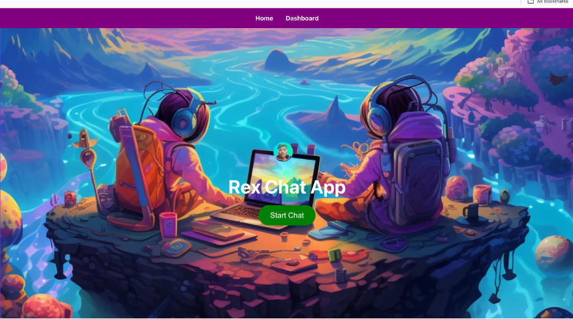
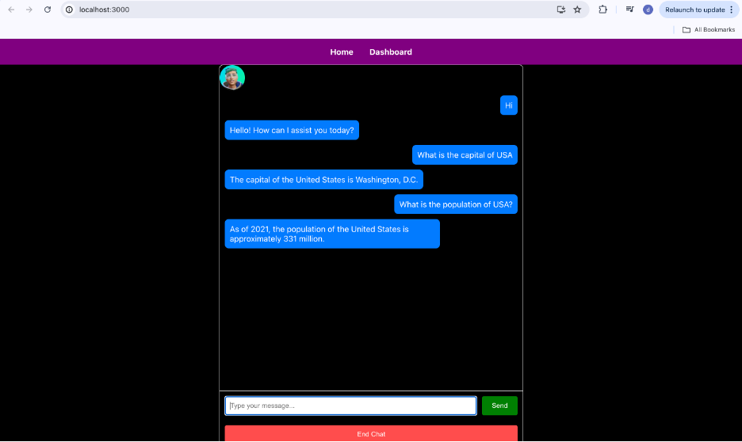
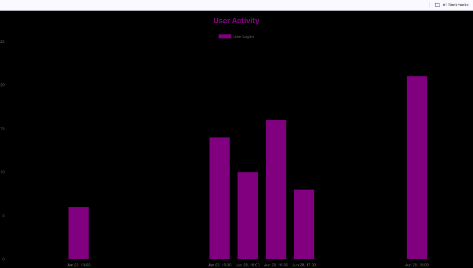
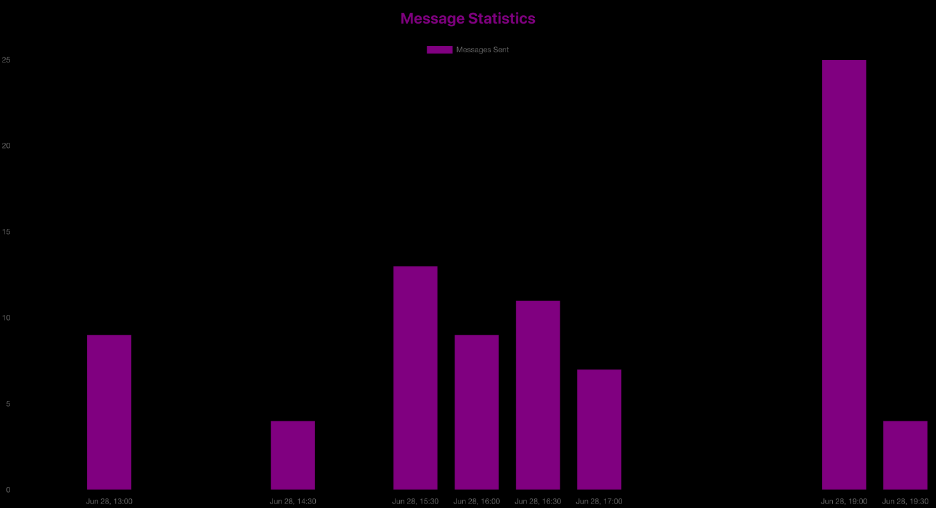

CosmoChat UI

Description:
In this app, users can interact with openAI assistant named ReX. This is done during the initial stage of my internship at RadicalAI

Tools Used:
ReactJS,Firebase,Open AI

Screenshots:

Execution:
Download this file and run
npm install
npm install firebase
npm install react-chartjs-2
npm start
Haping Coding!!!

